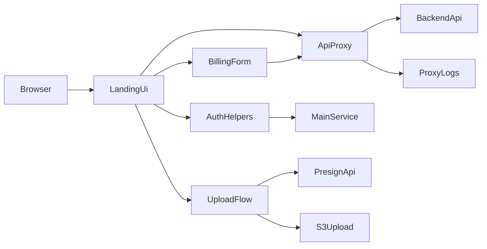
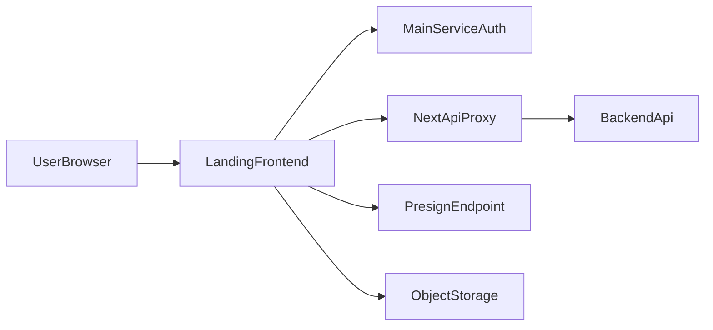

# Frontend Security Audit

작성일: 2026-03-18  
대상 레포: `c:\2025\talkgate_landing`  
범위: 프론트엔드 코드베이스 기준 1차 보안감사 초안

상태 기준:
- `안전함`: 코드상 방어 로직이 확인되고 현재 범위에서는 우회 가능성이 낮음
- `완화됨`: 코드 수정으로 주요 위험 패턴이 제거되었고 현재 코드 기준 즉시 악용 가능성은 낮아짐
- `재검증 필요`: 코드 수정 또는 보완은 반영되었지만 실제 브라우저/운영 환경에서 후속 검증이 필요함
- `확인 필요`: 프론트만 보고 확정할 수 없고 백엔드/인프라 검증이 필요함
- `이슈`: 현재 코드상 위험 패턴이 확인되거나 정책 부재가 명확함

## 코드베이스에서 파악한 핵심 감사 지점

- 인증/세션 핵심 흐름은 `lib/auth.ts`, `lib/apiClient.ts`, `app/api/proxy/[...path]/route.ts`, `app/api/auth/check/route.ts`, `app/api/auth/logout-callback/route.ts`, `app/api/auth/logout/route.ts`, `proxy.ts`에 집중되어 있습니다.
- 권한/접근제어는 `lib/projects.ts`, `lib/subscription.ts`, `app/pricing/PricingContent.tsx`, `modules/pricing/ProjectSelectStep.tsx`, `modules/pricing/PlanSelectStep.tsx`, `modules/pricing/CheckoutStep.tsx`를 보면 프론트 자체의 권한 판정보다 Admin 전용 API 응답에 의존하는 구조입니다.
- 업로드/파일 처리는 `modules/pricing/CreateProjectModal.tsx`, `lib/assets.ts`, `types/asset.ts`가 핵심이며, 현재 프론트 검증이 약합니다.
- 결제/민감정보 처리는 `modules/pricing/BillingRegisterModal.tsx`, `lib/billing.ts`, `types/billing.ts`, `app/api/proxy/[...path]/route.ts`에서 확인되며, 카드정보를 프론트가 직접 수집하고 프록시가 관련 요청/응답을 기록합니다.
- 렌더링/XSS 관점에서 `dangerouslySetInnerHTML`은 `app/layout.tsx`에서 정적 JSON-LD만 사용합니다. `window.open`, `postMessage`, `window.opener` 사용은 현재 코드에서 확인되지 않았습니다.
- 운영/배포 보안은 `next.config.ts`, `lib/env.ts`, `app/layout.tsx`, `app/test/page.tsx`, `app/robots.ts`가 핵심입니다. 앱 코드상 주요 보안 헤더 설정은 보이지 않습니다.

## 현재까지 확인된 대표 포인트

| ID | 상태 | 구분 | 대표 포인트 | 코드 근거 | 판단 이유 |
| --- | --- | --- | --- | --- | --- |
| FP-01 | 재검증 필요 | 인증/리다이렉트 | `returnUrl`/`callbackUrl`에 same-origin allowlist가 추가됨 | `lib/auth.ts`, `app/api/auth/logout-callback/route.ts` | 코드상 오픈 리다이렉트 완화 로직은 반영됐지만, 메인 서비스 로그아웃 연동과 브라우저별 리다이렉트 동작은 실제 검증이 필요합니다. |
| FP-02 | 이슈 | 세션/토큰 | 클라이언트는 refresh를 프록시가 처리한다고 가정하지만, 프록시는 `Set-Cookie` 전달이나 refresh 처리를 하지 않음 | `lib/apiClient.ts`, `app/api/proxy/[...path]/route.ts` | 토큰 재발급/세션 연장 동작이 구현과 주석 사이에서 불일치합니다. |
| FP-03 | 재검증 필요 | 로그아웃 | UI 로그아웃이 메인 서비스 로그아웃 플로우로 일원화됨 | `components/layout/Header.tsx`, `lib/auth.ts`, `app/api/auth/logout/route.ts` | 프론트 경로 불일치는 완화됐지만, 실제 서버 세션 무효화와 HttpOnly 쿠키 삭제가 운영 환경에서 기대대로 수행되는지 확인이 필요합니다. |
| FP-04 | 확인 필요 | 쿠키 정책 | 코드상 쿠키 도메인/속성 가정은 있으나 실제 발급 쿠키의 `HttpOnly`, `Secure`, `SameSite`, `Domain`은 확인되지 않음 | `lib/env.ts`, `lib/auth.ts`, `app/api/auth/logout-callback/route.ts` | 실제 쿠키는 메인 서비스 또는 백엔드에서 발급될 가능성이 높아 프론트만으로는 확정할 수 없습니다. |
| FP-05 | 완화됨 | 로깅/민감정보 | 인증 확인 API 로그가 최소 메타데이터 중심으로 축소됨 | `app/api/auth/check/route.ts` | 토큰 앞부분, 에러 body, stack 출력이 제거되어 기존 코드상 노출 패턴은 완화됐습니다. |
| FP-06 | 완화됨 | 로깅/결제 | 빌링/구독 프록시 로그가 allowlist 기반 메타데이터 로그로 축소됨 | `app/api/proxy/[...path]/route.ts` | 요청 body와 응답 전문 로그가 제거되어 기존 민감정보 노출 패턴은 완화됐습니다. |
| FP-07 | 재검증 필요 | 파일 업로드 | 프론트에서 SVG 차단과 5MB/MIME 검증이 추가됨 | `modules/pricing/CreateProjectModal.tsx` | 프론트 우회 경로는 줄었지만, presigned URL 발급 및 서버측 검증이 동일 기준인지 재검증이 필요합니다. |
| FP-08 | 확인 필요 | 업로드/스토리지 | presigned URL 발급 및 업로드 후 서빙 정책은 서버 정책 확인 필요 | `lib/assets.ts`, `types/asset.ts` | MIME, 크기 제한, SVG 차단, `Content-Disposition` 등은 프론트만으로 확정할 수 없습니다. |
| FP-09 | 확인 필요 | 권한 | Admin 화면은 전용 API 응답에 의존하며 프론트에서 역할을 별도로 강제하지 않음 | `lib/projects.ts`, `lib/subscription.ts`, `app/pricing/PricingContent.tsx` | 서버가 `/admin` 계열 엔드포인트에서 강제 검증해야 안전합니다. |
| FP-10 | 이슈 | 결제/규제 | 카드번호, 생년월일/사업자번호, 비밀번호 앞 2자리를 프론트가 직접 수집해 API로 전송 | `modules/pricing/BillingRegisterModal.tsx`, `types/billing.ts`, `lib/billing.ts` | 취급 민감도가 매우 높고 PCI 범위, 전송·로깅·보관 통제가 더 엄격해야 합니다. |
| FP-11 | 안전함 | XSS/렌더링 | `dangerouslySetInnerHTML`은 정적 JSON-LD만 렌더링함 | `app/layout.tsx` | 현재 범위에서는 사용자 입력 HTML 삽입이 보이지 않습니다. |
| FP-12 | 안전함 | 외부 링크 | `_blank` 링크에 `rel="noopener noreferrer"`가 적용됨 | `components/layout/Header.tsx`, `components/layout/SideDrawer.tsx` | 탭 하이재킹 방어가 확인됩니다. |
| FP-13 | 안전함 | 브라우저 메시징 | `window.open`, `postMessage`, `window.opener` 사용이 없음 | 전역 검색 기준 | 현재 범위에서는 팝업 메시지 흐름 리스크가 보이지 않습니다. |
| FP-14 | 이슈 | 환경설정 | `NEXT_PUBLIC_*` 값 누락 시 dev URL 기본값으로 연결될 수 있음 | `lib/env.ts`, `lib/auth.ts` | 비밀 노출 문제는 아니지만 배포 오구성 시 잘못된 서비스 연결 리스크가 있습니다. |
| FP-15 | 확인 필요 | 보안 헤더 | 앱 코드상 CSP/HSTS/XFO/Referrer-Policy 등 설정이 보이지 않음 | `next.config.ts` 및 전역 검색 | 인프라가 주입할 수 있으므로 응답 헤더 실측이 필요합니다. |
| FP-16 | 안전함 | 테스트 페이지 | `/test`는 production에서 홈으로 redirect됨 | `app/test/page.tsx` | 정상 production 빌드 기준 직접 노출 가능성은 낮습니다. |

## 보안감사 체크리스트

### 1. 인증/세션

| ID | 점검 항목 | 확인 방법 | 상태 | 심각도 | 담당 영역 | 바로 대응 |
| --- | --- | --- | --- | --- | --- | --- |
| AUTH-01 | access token 저장 위치와 브라우저 접근 가능 여부 확인 | `app/api/proxy/[...path]/route.ts`, `app/api/auth/check/route.ts`, `lib/auth.ts`, `lib/token.ts` 비교 및 실 서비스 쿠키 확인 | 확인 필요 | 높음 | 백엔드 | 아니오 |
| AUTH-02 | refresh token 저장 위치와 실제 refresh 동작 확인 | `lib/apiClient.ts`의 refresh 가정과 `app/api/proxy/[...path]/route.ts`의 헤더 전달 방식 비교 | 이슈 | 높음 | 프론트/백엔드 | 예 |
| AUTH-03 | 쿠키 속성 `HttpOnly/Secure/SameSite/Domain` 검증 | `lib/env.ts`, `app/api/auth/logout-callback/route.ts`의 삭제 옵션 확인 후 실제 `Set-Cookie` 응답 검증 | 확인 필요 | 높음 | 백엔드/인프라 | 아니오 |
| AUTH-04 | 자동 로그인/remember me/세션 지속 정책 확인 | `lib/apiClient.ts`, `hooks/useAuth.ts`, `app/api/auth/check/route.ts` 확인 | 확인 필요 | 중간 | 프론트/백엔드 | 아니오 |
| AUTH-05 | 세션 만료 및 401 처리 일관성 확인 | `lib/apiClient.ts`의 auto logout, refresh 예외, public route 예외 처리 점검 | 이슈 | 높음 | 프론트 | 예 |
| AUTH-06 | 로그아웃 시 서버 세션 무효화와 쿠키 삭제 보장 여부 확인 | `components/layout/Header.tsx`, `lib/auth.ts`, `app/api/auth/logout/route.ts`, `proxy.ts` 비교 | 재검증 필요 | 높음 | 프론트/백엔드 | 아니오 |
| AUTH-07 | OAuth/소셜 로그인/2FA/state 검증 확인 | 코드상 구현 부재 확인, 메인 서비스 인증 흐름 별도 확인 필요 | 확인 필요 | 높음 | 백엔드 | 아니오 |
| AUTH-08 | 서브도메인 간 세션 공유 정책 확인 | `NEXT_PUBLIC_COOKIE_DOMAIN`, 메인 서비스 로그인/로그아웃 경로, 실제 쿠키 Domain 검증 | 확인 필요 | 높음 | 백엔드/인프라 | 아니오 |
| AUTH-09 | API 프록시의 인증 헤더 및 `Set-Cookie` 전달 구조 확인 | `app/api/proxy/[...path]/route.ts`의 요청/응답 헤더 처리 점검 | 이슈 | 높음 | 프론트/백엔드 | 예 |
| AUTH-10 | `returnUrl/callbackUrl` allowlist 검증 확인 | `lib/auth.ts`, `app/api/auth/logout-callback/route.ts` 검토 | 재검증 필요 | 높음 | 프론트/백엔드 | 아니오 |

### 2. 권한/접근제어

| ID | 점검 항목 | 확인 방법 | 상태 | 심각도 | 담당 영역 | 바로 대응 |
| --- | --- | --- | --- | --- | --- | --- |
| AUTHZ-01 | 관리자/운영자 UI가 프론트 노출만으로 제한되는지 확인 | `lib/projects.ts`, `lib/subscription.ts`, `app/pricing/PricingContent.tsx` 확인 | 확인 필요 | 높음 | 백엔드 | 아니오 |
| AUTHZ-02 | 프로젝트/팀/멤버 단위 권한 분리 확인 | `x-project-id` 헤더 사용처와 선택 프로젝트 흐름 검토 | 확인 필요 | 높음 | 백엔드 | 아니오 |
| AUTHZ-03 | 민감 기능(구독 시작/변경/취소/쿠폰 적용) 서버 강제 여부 확인 | `lib/subscription.ts`, `modules/pricing/PlanSelectStep.tsx`, `modules/pricing/CheckoutStep.tsx` 점검 | 확인 필요 | 높음 | 백엔드 | 아니오 |
| AUTHZ-04 | 프론트가 `Admin` 전용 API 실패를 권한 문제로 올바르게 처리하는지 확인 | `PricingContent`, `ProjectSelectStep`, `PlanSelectStep`의 실패 처리 확인 | 확인 필요 | 중간 | 프론트 | 예 |
| AUTHZ-05 | `x-project-id` 변조 시 서버가 소유/역할 검증하는지 확인 | `lib/apiClient.ts`, `lib/subscription.ts` 확인 후 서버 검증 필요 | 확인 필요 | 높음 | 백엔드 | 아니오 |

### 3. 입력값/XSS/렌더링

| ID | 점검 항목 | 확인 방법 | 상태 | 심각도 | 담당 영역 | 바로 대응 |
| --- | --- | --- | --- | --- | --- | --- |
| XSS-01 | `dangerouslySetInnerHTML` 사용처와 데이터 원천 확인 | `app/layout.tsx` 검토 | 안전함 | 낮음 | 프론트 | 아니오 |
| XSS-02 | 사용자 입력/서버 메시지 렌더링 시 HTML 삽입 여부 확인 | `CreateProjectModal`, `PlanSelectStep`, `CheckoutStep`, `BillingRegisterModal`의 에러 메시지 출력 확인 | 안전함 | 낮음 | 프론트 | 아니오 |
| XSS-03 | 백엔드 메시지를 사용자에게 직접 노출하는지 확인 | `CreateProjectModal.tsx`, `PlanSelectStep.tsx`, `CheckoutStep.tsx`, `BillingRegisterModal.tsx`의 사용자 노출 문구 점검 | 완화됨 | 중간 | 프론트/백엔드 | 아니오 |
| XSS-04 | `redirectUrl`, `returnUrl`, query param 처리 안전성 확인 | `lib/auth.ts`, `app/api/auth/logout-callback/route.ts`, `app/pricing/PricingContent.tsx` 검토 | 재검증 필요 | 높음 | 프론트 | 아니오 |
| XSS-05 | `postMessage`, `window.opener`, `window.open` 사용 여부 확인 | 전역 검색 결과 확인 | 안전함 | 낮음 | 프론트 | 아니오 |
| XSS-06 | 외부 링크 새 창 열기 시 `noopener`, `noreferrer` 적용 확인 | `Header.tsx`, `SideDrawer.tsx` 확인 | 안전함 | 낮음 | 프론트 | 아니오 |

### 4. 파일 업로드/다운로드

| ID | 점검 항목 | 확인 방법 | 상태 | 심각도 | 담당 영역 | 바로 대응 |
| --- | --- | --- | --- | --- | --- | --- |
| FILE-01 | 확장자/MIME 허용 범위 일치 여부 확인 | `CreateProjectModal.tsx`의 `accept`, `getFileType()`, drag-and-drop 경로 비교 | 완화됨 | 중간 | 프론트 | 아니오 |
| FILE-02 | 업로드 파일 용량 제한 확인 | UI 문구와 실제 `file.size` 검사 여부 확인 | 완화됨 | 중간 | 프론트 | 아니오 |
| FILE-03 | SVG 허용 정책 점검 | `accept="image/svg+xml"`와 미리보기/로고 렌더링 확인 | 재검증 필요 | 높음 | 프론트/백엔드 | 아니오 |
| FILE-04 | presigned URL 발급 시 MIME/크기/경로 서버 검증 확인 | `lib/assets.ts`, `types/asset.ts` 확인 후 백엔드 API 검증 필요 | 확인 필요 | 높음 | 백엔드 | 아니오 |
| FILE-05 | 업로드 후 파일 서빙 시 `Content-Type`, `Content-Disposition`, CSP 정책 확인 | 스토리지/백엔드 응답 검증 필요 | 확인 필요 | 높음 | 백엔드/인프라 | 아니오 |
| FILE-06 | 다운로드/새 창 열기 보안성 확인 | 파일 다운로드 전용 흐름 부재, generic blob 지원만 존재 | 확인 필요 | 중간 | 프론트/백엔드 | 아니오 |

### 5. 외부 연동/팝업

| ID | 점검 항목 | 확인 방법 | 상태 | 심각도 | 담당 영역 | 바로 대응 |
| --- | --- | --- | --- | --- | --- | --- |
| EXT-01 | 메인 서비스 로그인/로그아웃 이동 시 redirect allowlist 여부 확인 | `getLoginUrl()`, `getLogoutUrl()`, `logout-callback` 흐름 검토 | 재검증 필요 | 높음 | 프론트/백엔드 | 아니오 |
| EXT-02 | OAuth callback/state/sessionStorage 사용 방식 확인 | 코드상 구현 부재, 메인 서비스 별도 감사 필요 | 확인 필요 | 높음 | 백엔드 | 아니오 |
| EXT-03 | 외부 도메인 이동 정책 문서화 여부 확인 | 메인 서비스와 랜딩 간 이동 외 allowlist/차단 규칙 확인 필요 | 확인 필요 | 중간 | 프론트/백엔드 | 아니오 |
| EXT-04 | 팝업 메시지 흐름(`postMessage`) 존재 여부 확인 | 전역 검색 결과 기준 부재 | 안전함 | 낮음 | 프론트 | 아니오 |

### 6. 설정/배포/운영 보안

| ID | 점검 항목 | 확인 방법 | 상태 | 심각도 | 담당 영역 | 바로 대응 |
| --- | --- | --- | --- | --- | --- | --- |
| OPS-01 | `NEXT_PUBLIC_*` 값 중 민감값 노출 여부 확인 | `lib/env.ts`, `app/layout.tsx` 확인 | 안전함 | 낮음 | 프론트 | 아니오 |
| OPS-02 | 환경변수 누락 시 dev 엔드포인트 기본값 사용 여부 확인 | `lib/env.ts`, `lib/auth.ts`의 기본값/보정 로직 확인 | 이슈 | 중간 | 프론트/인프라 | 예 |
| OPS-03 | 보안 헤더(CSP, HSTS, XFO, Referrer-Policy 등) 설정 여부 확인 | `next.config.ts`와 전역 검색 결과 확인, 실제 응답 헤더 측정 필요 | 확인 필요 | 높음 | 인프라 | 아니오 |
| OPS-04 | 인증 관련 로그에 민감정보가 포함되는지 확인 | `app/api/auth/check/route.ts` 로그 확인 | 완화됨 | 중간 | 프론트 | 아니오 |
| OPS-05 | 프록시 로그에 결제/구독/응답 데이터가 남는지 확인 | `app/api/proxy/[...path]/route.ts`의 request/response logging 확인 | 완화됨 | 높음 | 프론트/백엔드 | 아니오 |
| OPS-06 | debug/test 페이지 노출 통제 여부 확인 | `app/test/page.tsx`, `app/robots.ts` 확인 | 안전함 | 낮음 | 프론트 | 아니오 |
| OPS-07 | source map / 번들 노출 정책 확인 | 코드상 명시적 정책 부재, 배포 아티팩트 및 CDN 확인 필요 | 확인 필요 | 중간 | 인프라 | 아니오 |

### 7. 의존성/운영 리스크

| ID | 점검 항목 | 확인 방법 | 상태 | 심각도 | 담당 영역 | 바로 대응 |
| --- | --- | --- | --- | --- | --- | --- |
| RISK-01 | 주요 패키지 취약점 점검 필요 여부 확인 | `package.json`, `package-lock.json` 기준 SCA 필요 | 확인 필요 | 중간 | 인프라 | 아니오 |
| RISK-02 | 에러 모니터링/감사 로그/사고 대응 체계 확인 | 코드상 별도 APM/SIEM 연동 흔적 부재 | 확인 필요 | 중간 | 인프라 | 아니오 |
| RISK-03 | 프론트/백엔드/인프라 책임 경계 문서화 여부 확인 | 인증, 권한, 쿠키, 업로드, 보안 헤더 각 책임 분리 필요 | 확인 필요 | 중간 | 프론트/백엔드/인프라 | 아니오 |
| RISK-04 | 결제정보 직접 수집 구조의 PCI 범위 검토 | `BillingRegisterModal.tsx`, `types/billing.ts`, `lib/billing.ts` 기준 데이터 흐름 확인 | 이슈 | 높음 | 프론트/백엔드/인프라 | 예 |

## 감사 수행용 투두리스트

### P0

#### 지금 바로 프론트에서 수정 가능한 것

| 우선순위 | 항목 | 현재 근거 | 권장 조치 | 담당 |
| --- | --- | --- | --- | --- |
| P0 | `returnUrl` 동일 출처/allowlist 검증 추가 | `lib/auth.ts`, `app/api/auth/logout-callback/route.ts` | 절대 URL 차단, 허용 경로만 통과, 실패 시 `/`로 fallback | 프론트 |
| P0 | 로그아웃 경로 일원화 | `Header.tsx`, `lib/auth.ts`, `app/api/auth/logout/route.ts` | UI가 서버 로그아웃 API 또는 메인 서비스 로그아웃 플로우만 사용하도록 통일 | 프론트 |
| P0 | 프록시 로그 축소 또는 제거 | `app/api/proxy/[...path]/route.ts` | 빌링/구독 요청 바디, 응답 전문 로그 제거 또는 안전 필드 allowlist 방식 전환 | 프론트 |
| P0 | 인증 확인 로그에서 토큰/에러 바디 출력 제거 | `app/api/auth/check/route.ts` | 토큰 길이/앞부분/stack/body 출력 제거, 최소 메타데이터만 남기기 | 프론트 |
| P0 | 업로드에서 SVG 차단 및 용량/MIME 검증 추가 | `CreateProjectModal.tsx` | 허용 타입을 PNG/JPEG/WEBP로 제한, `file.size` 검사 추가, drag-and-drop 검사 일치화 | 프론트 |

#### 협업이 필요한 것

| 우선순위 | 항목 | 현재 근거 | 협업 필요 사항 | 담당 |
| --- | --- | --- | --- | --- |
| P0 | refresh 토큰 재발급 구조 확정 | `lib/apiClient.ts`, `app/api/proxy/[...path]/route.ts` | 프록시가 refresh/`Set-Cookie`를 처리할지, 메인 서비스가 별도 처리할지 구조 확정 | 프론트/백엔드 |
| P0 | 서버 권한 강제 검증 | `lib/subscription.ts`, `lib/projects.ts` | `/admin` 및 `x-project-id` 기반 엔드포인트가 서버에서 역할과 소유권을 강제하는지 검증 | 백엔드 |
| P0 | 결제정보 직접 수집 구조 검토 | `BillingRegisterModal.tsx`, `lib/billing.ts` | PCI 범위, 토큰화 여부, 결제대행사 hosted flow 전환 가능성 검토 | 프론트/백엔드/인프라 |
| P0 | 실제 쿠키 보안속성 검증 | `lib/env.ts`, `lib/auth.ts` | 실 서비스 응답에서 `HttpOnly`, `Secure`, `SameSite`, `Domain` 확인 | 백엔드/인프라 |
| P0 | 오픈 리다이렉트 allowlist 서버 검증 | `getLoginUrl`, `getLogoutUrl`, `logout-callback` | 메인 서비스도 `callbackUrl/returnUrl` allowlist 강제 필요 | 백엔드 |

### P1

#### 지금 바로 프론트에서 수정 가능한 것

| 우선순위 | 항목 | 현재 근거 | 권장 조치 | 담당 |
| --- | --- | --- | --- | --- |
| P1 | 백엔드 에러 메시지 직접 노출 최소화 | `CreateProjectModal.tsx`, `PlanSelectStep.tsx`, `CheckoutStep.tsx`, `BillingRegisterModal.tsx` | 사용자 노출 메시지를 일반화하도록 1차 반영 완료, 추가로 내부 추적 체계 분리가 필요 | 프론트 |
| P1 | 환경변수 누락 시 dev 기본값 연결 방지 | `lib/env.ts` | production 빌드에서는 필수 env 미설정 시 실패하도록 변경 | 프론트 |
| P1 | 권한 실패 UX 정비 | `PricingContent.tsx`, `ProjectSelectStep.tsx`, `PlanSelectStep.tsx` | 401/403/권한없음 상태를 명시적으로 분리하고 안내 메시지 표준화 | 프론트 |

#### 협업이 필요한 것

| 우선순위 | 항목 | 현재 근거 | 협업 필요 사항 | 담당 |
| --- | --- | --- | --- | --- |
| P1 | presigned URL 정책 검증 | `lib/assets.ts`, `types/asset.ts` | MIME, 파일 크기, 확장자, SVG 차단, 버킷 경로 제한 검증 | 백엔드 |
| P1 | 스토리지 파일 서빙 정책 검증 | 업로드 후 `fileUrl` 사용 구조 | `Content-Disposition`, `Content-Type`, CDN/CSP, 이미지 프록시 사용 여부 검토 | 백엔드/인프라 |
| P1 | 보안 헤더 실측 및 표준화 | `next.config.ts` | CSP, HSTS, XFO, Referrer-Policy, Permissions-Policy 적용 여부 확인 | 인프라 |
| P1 | source map 노출 정책 확정 | 코드상 명시 없음 | production source map 비공개/사설 업로드 정책 수립 | 인프라 |

### P2

#### 지금 바로 프론트에서 수정 가능한 것

| 우선순위 | 항목 | 현재 근거 | 권장 조치 | 담당 |
| --- | --- | --- | --- | --- |
| P2 | 보안감사 기준 문서화 | 현재 문서 초안 | 인증, 권한, 업로드, 로깅 기준을 팀 공통 문서로 고정 | 프론트 |
| P2 | 테스트 페이지 운영 기준 명시 | `app/test/page.tsx`, `app/robots.ts` | preview/dev 공개 정책과 접근 범위 문서화 | 프론트 |

#### 협업이 필요한 것

| 우선순위 | 항목 | 현재 근거 | 협업 필요 사항 | 담당 |
| --- | --- | --- | --- | --- |
| P2 | 의존성 취약점 자동 스캔 | `package.json`, `package-lock.json` | CI에서 SCA 스캔 및 정기 패치 정책 수립 | 인프라 |
| P2 | 사고 대응/감사 로그 체계 | 코드상 별도 체계 부재 | 보안 이벤트 수집, 보존, 검색, 알림 절차 정리 | 백엔드/인프라 |
| P2 | 역할/책임 경계 문서화 | 인증/권한/헤더/스토리지가 다중 시스템에 분산 | 프론트/백엔드/인프라 RACI 정리 | 프론트/백엔드/인프라 |

## 보고서 형식 제안

아래 형식은 이 레포 1차 프론트 보안감사 보고서 템플릿으로 바로 사용할 수 있습니다.

### 1. 개요

- 감사 목적: 프론트엔드 코드 관점에서 인증, 권한, 입력값, 업로드, 외부연동, 운영보안 리스크를 식별하고 즉시 조치 가능 항목과 협업 필요 항목을 분리한다.
- 감사 일자: `YYYY-MM-DD`
- 감사자: `담당자명`
- 대상 시스템: `talkgate_landing`
- 기준 버전: `commit/tag/branch`

### 2. 감사 범위

- 포함 범위:
  - 인증/세션: `lib/auth.ts`, `lib/apiClient.ts`, `app/api/proxy/[...path]/route.ts`, `app/api/auth/*`
  - 권한/구독/프로젝트: `lib/projects.ts`, `lib/subscription.ts`, `app/pricing/*`, `modules/pricing/*`
  - 업로드/결제: `lib/assets.ts`, `modules/pricing/CreateProjectModal.tsx`, `modules/pricing/BillingRegisterModal.tsx`
  - 운영/설정: `next.config.ts`, `lib/env.ts`, `app/layout.tsx`, `app/test/page.tsx`
- 제외 범위:
  - 메인 서비스 서버 구현
  - API 서버 권한 검증 로직
  - CDN/WAF/Ingress/스토리지 정책

### 3. 아키텍처 요약

- 랜딩 프론트는 메인 서비스 로그인/로그아웃 흐름을 사용합니다.
- API 호출은 브라우저에서 직접 백엔드로 가지 않고 `/api/proxy`를 경유합니다.
- 파일 업로드는 presigned URL 발급 후 스토리지로 직접 업로드합니다.
- 결제수단 등록은 프론트에서 카드 관련 정보를 직접 입력받아 API로 전달합니다.

### 4. 점검 결과 요약

| 구분 | 건수 | 비고 |
| --- | --- | --- |
| 이슈 | `3` | refresh 구조 불일치, 결제정보 직접 수집, 환경변수 누락 시 dev 기본값 연결 위험 |
| 재검증 필요 | `3` | 리다이렉트 allowlist, 로그아웃 일원화, 프론트 업로드 검증 강화 후 운영 검증 필요 |
| 완화됨 | `2` | 인증 로그 축소, 프록시 민감 로그 축소 |
| 확인 필요 | `4` | 실제 쿠키 속성, 권한 강제, 보안 헤더, presigned URL/파일 서빙 정책 등 |
| 안전함 | `4` | 정적 JSON-LD만의 `dangerouslySetInnerHTML`, `_blank` 링크 보호, 브라우저 메시징 부재, 테스트 페이지 production redirect |

### 5. 상세 이슈 목록

| ID | 제목 | 상태 | 심각도 | 영향 범위 | 코드 근거 | 권장 조치 |
| --- | --- | --- | --- | --- | --- | --- |
| AUTH-02 | refresh 토큰 처리 구조 불일치 | 이슈 | 높음 | 세션 유지, 자동 로그인, 세션 만료 처리 | `lib/apiClient.ts`, `app/api/proxy/[...path]/route.ts` | 프록시가 refresh/`Set-Cookie`를 실제 처리하도록 구조를 확정하거나, 클라이언트 가정을 제거해 인증 만료 흐름을 명확히 분리 |
| RISK-04 | 결제정보 직접 수집 구조 | 이슈 | 높음 | 카드정보, 생년월일/사업자번호, 결제 컴플라이언스 | `modules/pricing/BillingRegisterModal.tsx`, `types/billing.ts`, `lib/billing.ts` | hosted payment/tokenization 전환 가능성을 우선 검토하고, 현 구조 유지 시 PCI 범위와 전송/로그/운영 통제를 별도 문서화 |
| OPS-02 | production env 누락 시 dev 기본값 사용 가능성 | 이슈 | 중간 | 잘못된 서비스 연결, 운영 오구성 | `lib/env.ts`, `lib/auth.ts` | production 빌드에서 필수 env 누락 시 fail-fast하도록 수정하고 배포 파이프라인 검증 추가 |
| AUTH-10 | `returnUrl/callbackUrl` allowlist 적용 | 재검증 필요 | 높음 | 인증 후 사용자 이동 | `lib/auth.ts`, `app/api/auth/logout-callback/route.ts` | 코드상 same-origin allowlist는 반영됐으므로, 메인 서비스와 연계된 실제 로그인/로그아웃 플로우에서 우회가 없는지 재검증 |
| AUTH-06 | 로그아웃 플로우 일원화 | 재검증 필요 | 높음 | 세션 종료, 쿠키 삭제, 사용자 이탈 경로 | `components/layout/Header.tsx`, `lib/auth.ts` | 프론트는 메인 서비스 로그아웃으로 일원화했으므로 실제 서버 세션 무효화와 HttpOnly 쿠키 삭제 결과를 브라우저에서 확인 |
| FILE-03 | SVG 차단 및 업로드 검증 강화 | 재검증 필요 | 높음 | 파일 업로드, 스토리지 악용 가능성 | `modules/pricing/CreateProjectModal.tsx`, `lib/assets.ts` | 프론트 검증 외에 presigned URL 발급 API와 파일 서빙 정책이 동일 기준으로 동작하는지 점검 |
| OPS-04 | 인증 관련 민감 로그 축소 | 완화됨 | 중간 | 로그 수집 시스템, 개발/프리뷰 환경 | `app/api/auth/check/route.ts` | 토큰 일부/에러 body/stack 노출은 제거됐으므로 현재 변경을 유지하고 수집 파이프라인에서도 민감 마스킹을 확인 |
| OPS-05 | 프록시 민감 로그 축소 | 완화됨 | 높음 | 빌링/구독 요청 및 응답 로그 | `app/api/proxy/[...path]/route.ts` | body/응답 전문 대신 메타데이터 allowlist 로그로 축소했으므로 운영 로그에서도 동일 포맷만 남는지 확인 |

### 6. 안전하다고 판단한 항목

| ID | 항목 | 코드 근거 | 판단 이유 |
| --- | --- | --- | --- |
| 예: XSS-01 | 정적 JSON-LD 삽입 | `app/layout.tsx` | 사용자 입력 기반 HTML 삽입이 아님 |

### 7. 백엔드/인프라 확인 필요 항목

| ID | 항목 | 확인 대상 | 확인 방법 |
| --- | --- | --- | --- |
| 예: AUTH-03 | 실제 쿠키 보안 속성 | 백엔드/인프라 | 로그인 응답의 `Set-Cookie` 확인 |

### 8. 우선순위별 개선 과제

| 우선순위 | 과제 | 담당 | 목표 일정 | 비고 |
| --- | --- | --- | --- | --- |
| P0 | 리다이렉트 검증, 로그 정리, 업로드 검증 강화 | 프론트 | `YYYY-MM-DD` | 즉시 조치 가능 |
| P0 | 쿠키 속성/권한 강제/refresh 구조 검증 | 백엔드/인프라 | `YYYY-MM-DD` | 협업 필요 |

## 즉시 조치 가능한 항목 / 후속 협업 필요 항목

### 즉시 조치 가능한 항목

아래 항목은 이번 P0 코드 수정으로 1차 반영되었습니다.

- `app/api/auth/logout-callback/route.ts`에서 `returnUrl`을 동일 출처 또는 허용 경로로 제한했습니다.
- `lib/auth.ts`에 `sanitizeReturnUrl()`과 로그아웃 콜백 고정 경로 검증을 추가했습니다.
- `components/layout/Header.tsx`의 로그아웃을 메인 서비스 로그아웃 플로우로 일원화했습니다.
- `app/api/auth/check/route.ts`에서 토큰 앞부분, 응답 body, stack 출력 로그를 제거했습니다.
- `app/api/proxy/[...path]/route.ts`에서 빌링/구독 요청/응답 전문 로깅을 제거하고 allowlist 기반 메타로그로 축소했습니다.
- `modules/pricing/CreateProjectModal.tsx`에서 SVG를 차단하고, 용량 및 MIME 검증을 추가하며, drag-and-drop 경로를 `accept` 정책과 일치시켰습니다.
- `modules/pricing/CreateProjectModal.tsx`, `PlanSelectStep.tsx`, `CheckoutStep.tsx`, `BillingRegisterModal.tsx`에서 백엔드 원문 에러 메시지 노출을 일반화합니다.
- `lib/env.ts`에서 production 필수 env 미설정 시 dev 기본값으로 동작하지 않도록 fail-fast 정책을 적용합니다.

### allowlist 설계 기준

- 리다이렉트 allowlist:
  - 상대 경로만 기본 허용합니다. 예: `/`, `/pricing`, `/pricing?step=project`
  - 절대 URL은 현재 랜딩 origin과 완전히 일치하는 경우만 허용합니다.
  - 로그아웃 콜백용 `callbackUrl`은 랜딩 서비스의 `/api/auth/logout-callback`만 허용 대상으로 둡니다.
  - 메인 서비스와 랜딩 서비스 사이의 이동도 문자열 결합이 아니라 `URL.origin` 기준 검증을 사용합니다.
- 로그 allowlist:
  - 요청/응답 로깅은 path, method, status, projectId 존재 여부처럼 운영상 필요한 최소 메타데이터만 허용합니다.
  - body, token, 카드정보, 쿠키, 백엔드 원문 에러 body는 기본적으로 로그 금지 대상입니다.
- 업로드 allowlist:
  - 프론트 허용 MIME은 `image/png`, `image/jpeg`, `image/webp`만 허용합니다.
  - SVG, GIF, 임의 `image/*`는 기본 거부합니다.
  - 용량은 프론트와 서버가 동일 기준으로 검증해야 하며, 프론트는 우선 5MB 상한을 강제합니다.

### 후속 협업 필요 항목

- 메인 서비스/백엔드가 실제로 발급하는 `tg_access_token`, `tg_refresh_token` 쿠키의 `HttpOnly`, `Secure`, `SameSite`, `Domain`을 검증해야 합니다.
- `/v1/projects/admin`, `/v1/subscriptions/admin/projects`, `x-project-id` 기반 엔드포인트가 서버에서 역할과 소유권을 강제하는지 확인해야 합니다.
- refresh 토큰 재발급과 `Set-Cookie` 반영을 프록시가 담당할지, 메인 서비스가 담당할지 구조를 확정해야 합니다.
- presigned URL 발급 API가 파일 크기, MIME, 확장자, SVG 허용 여부를 서버에서 제한하는지 확인해야 합니다.
- 업로드된 파일이 어떤 도메인과 헤더로 서빙되는지, 특히 SVG가 active content로 실행될 여지가 없는지 확인해야 합니다.
- 인프라에서 CSP, HSTS, X-Frame-Options, Referrer-Policy, Permissions-Policy, source map 노출 정책을 실제 응답 기준으로 검증해야 합니다.
- 결제정보 직접 수집 구조가 결제대행사 요구사항과 PCI 범위에 맞는지 보안/컴플라이언스 관점에서 재검토해야 합니다.
